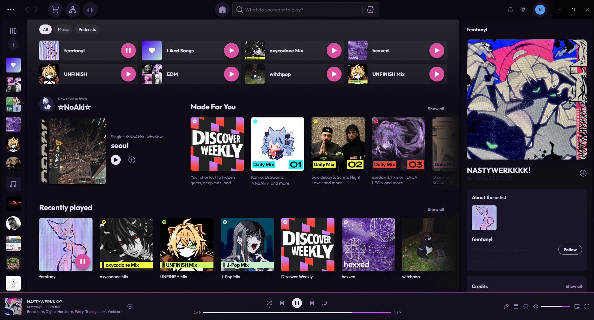

# p1nk v01d



A warm dark Spicetify theme with pink-purple soul.


## Preview

Dark surfaces with warm pink (`#d94f9e`) and purple (`#b44de0`) accents. Includes a cyan-to-purple gradient progress bar, frosted glass context menus, and subtle glow effects throughout.

## Install

### Quick install

```bash
git clone https://github.com/0x25CBFC4F/spicetify-pink-void.git
cd spicetify-pink-void
npm run install-theme
```

### Manual install

1. Copy `color.ini` and `user.css` into your Spicetify Themes folder:

   | OS | Path |
   |---|---|
   | Windows | `%appdata%\spicetify\Themes\p1nk v01d\` |
   | Linux / macOS | `~/.config/spicetify/Themes/p1nk v01d/` |

2. Apply:

   ```bash
   spicetify config current_theme "p1nk v01d" color_scheme "p1nk v01d"
   spicetify apply
   ```

## Color schemes

| Scheme | Accent | Vibe |
|--------|--------|------|
| **p1nk v01d** | `#d94f9e` (pink) | Warm, rosy, the default |
| **p1nk v01d Deeper** | `#b44de0` (purple) | Moodier, more violet |

Switch scheme:

```bash
spicetify config color_scheme "p1nk v01d Deeper"
spicetify apply
```

## npm scripts

| Command | Description |
|---------|-------------|
| `npm run deploy` | Copy theme files to Spicetify Themes directory |
| `npm run apply` | Set p1nk v01d as active theme and apply |
| `npm run install-theme` | Deploy + apply in one command |
| `npm run uninstall` | Restore Spotify to default |

## Uninstall

```bash
npm run uninstall
```

Or manually:

```bash
spicetify restore
```

## Credits

Theme made with love by **nullie** & **claude** #transrights
